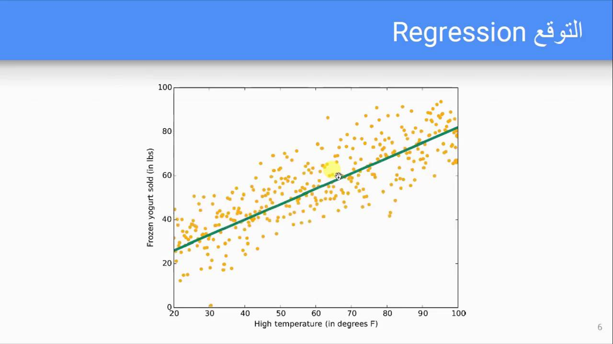
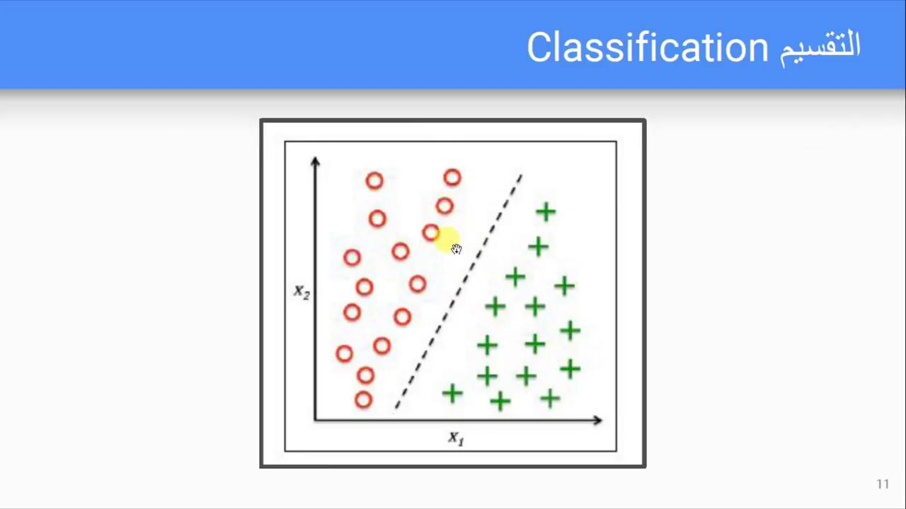
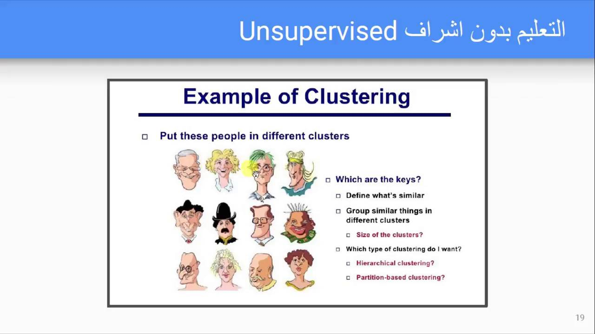

## مقدمة في تعلم الآلة

تعلم الآلة هو مجال في الذكاء الاصطناعي يهتم بتطوير الخوارزميات التي تسمح للكمبيوترات بالتعلم من البيانات. هناك نوعان رئيسيان من تعلم الآلة: تعلم الآلة الخاضع للإشراف (Supervised Machine Learning) وتعلم الآلة غير الخاضع للإشراف (Unsupervised Machine Learning).

## تعلم الآلة الخاضع للإشراف

في تعلم الآلة الخاضع للإشراف، يتم توفير البيانات للخوارزمية مع الإجابات الصحيحة. الهدف هو تعلم العلاقة بين البيانات والإجابات الصحيحة ليمكن استخدامها في توقع الإجابات للبيانات الجديدة.

### التوقع (Regression)

التوقع هو نوع من تعلم الآلة الخاضع للإشراف حيث يتم توفير البيانات للخوارزمية مع القيم المستمرة. الهدف هو تعلم العلاقة بين البيانات والقيم المستمرة ليمكن استخدامها في توقع القيم الجديدة.

مثال على التوقع هو توقع أسعار البيوت بناءً على البيانات مثل عدد الغرف، المساحة، والموقع.

### التصنيف (Classification)

التصنيف هو نوع من تعلم الآلة الخاضع للإشراف حيث يتم توفير البيانات للخوارزمية مع التصنيفات الصحيحة. الهدف هو تعلم العلاقة بين البيانات والتصنيفات الصحيحة ليمكن استخدامها في تصنيف البيانات الجديدة.

مثال على التصنيف هو تصنيف الصور إلى فئات مثل القطط، الكلاب، أو السيارات.

## تعلم الآلة غير الخاضع للإشراف

في تعلم الآلة غير الخاضع للإشراف، لا يتم توفير الإجابات الصحيحة للخوارزمية. الهدف هو اكتشاف الأنماط والعلاقات في البيانات.

### التجميع (Clustering)

التجميع هو نوع من تعلم الآلة غير الخاضع للإشراف حيث يتم تجميع البيانات في مجموعات متشابهة.

مثال على التجميع هو تجميع العملاء بناءً على سلوكياتهم في الشراء.

## تطبيقات تعلم الآلة

تطبيقات تعلم الآلة واسعة ومتنوعة، وتشمل:

* توقع أسعار الأسهم
* تصنيف الصور
* تجميع العملاء
* توقع حالة الطقس

## الخلاصة

تعلم الآلة هو مجال مهم في الذكاء الاصطناعي يهتم بتطوير الخوارزميات التي تسمح للكمبيوترات بالتعلم من البيانات. هناك نوعان رئيسيان من تعلم الآلة: تعلم الآلة الخاضع للإشراف وتعلم الآلة غير الخاضع للإشراف. التوقع والتصنيف هما نوعان من تعلم الآلة الخاضع للإشراف، بينما التجميع هو نوع من تعلم الآلة غير الخاضع للإشراف.